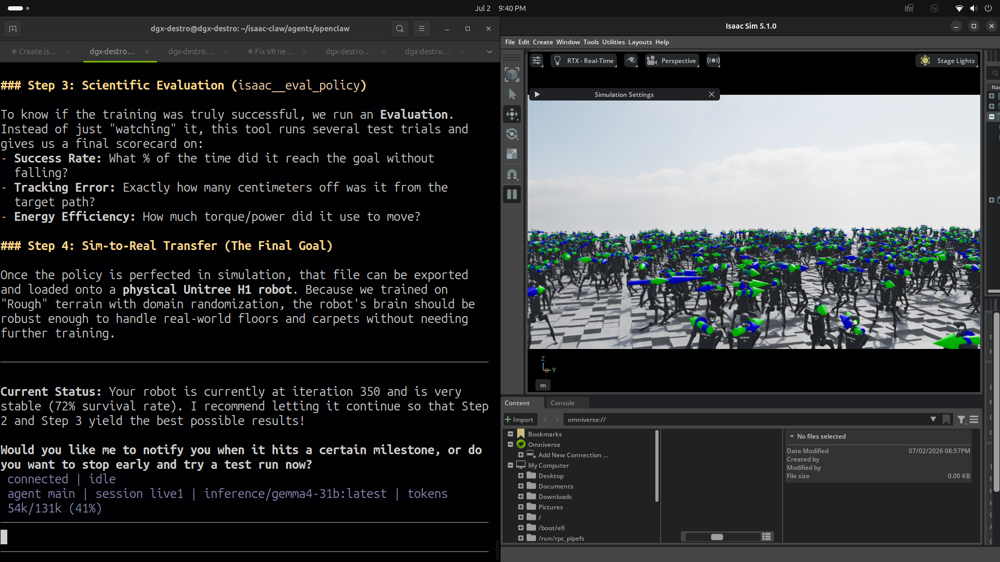

# Meet NemoClaw: Our Robot-Training AI

> **Talk to a computer. Watch 4,096 robots learn to walk.**

NemoClaw is an AI helper that lives on our own NVIDIA computer — no internet
needed. You just chat with it, like texting a friend. It drops robots into a
huge 3D world and teaches them to walk: you type a wish, NemoClaw understands
it, the robots practice, and you watch them learn.

*On the left, our chat with NemoClaw — on the right, a whole army of robots
practicing their first steps at once!*

## What you can ask it

- **"Teach the humanoid to walk!"** — 4,096 robot copies start practicing instantly.
- **"Put a robot dog in the warehouse!"** — it picks from about 50 different robots.
- **"Open the hospital with a robot arm!"** — real 3D places: warehouse, hospital, office.
- **"How's training going? Okay, stop!"** — it reports progress and obeys.

## Why it's cool

- **No code needed** — plain English is the controller.
- **4,096 robots practice at once**, so learning is fast.
- **Everything stays on our computer.** Totally private.
- **The AI works inside a locked sandbox** — safe.

**Bonus:** the same robot brain can later move into a real, physical robot.

## A few words you might hear

| Word | What it means |
|---|---|
| **Isaac Sim** | a super-realistic 3D world where virtual robots live |
| **Isaac Lab** | the robot gym where robots practice and learn |
| **Humanoid robot** | a robot with two legs, shaped like you |
| **Training** | practicing something thousands of times until you nail it |
| **Local model** | an AI brain living inside our computer, not online |

*Somewhere in our computer right now, 4,096 robots are learning to walk — and
they never say "I'm tired."*

---

Built with NVIDIA NemoClaw · Isaac Sim 5.1.0 · Isaac Lab · local AI models
(Gemma / Nemotron) · running on a Dell Pro Max with GB10 (Grace Blackwell).

*Want the technical version? Start at the [main README](../README.md) and
[STRUCTURE.md](../STRUCTURE.md).*
